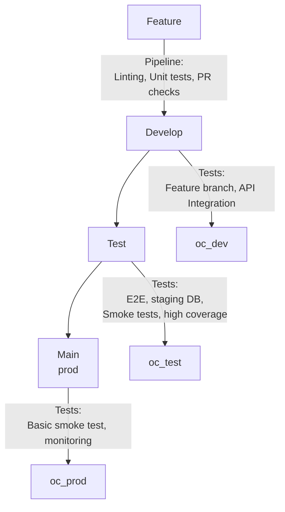

## Contributing 
---
## How to contribute
Government employees, public and members of the private sector are encouraged to contribute to the repository by **forking and submitting a pull request**. 

(If you are new to GitHub, you might start with a [basic tutorial](https://help.github.com/articles/set-up-git) and  check out a more detailed guide to [pull requests](https://help.github.com/articles/using-pull-requests/).)

Pull requests will be evaluated by the repository guardians on a schedule and if deemed beneficial will be committed to the main.

All contributors retain the original copyright to their stuff, but by contributing to this project, you grant a world-wide, royalty-free, perpetual, irrevocable, non-exclusive, transferable license to all users **under the terms of the license under which this project is distributed.**

## Contributing Project team members -> Current

Currently, the repository is not set up for a dev / test / prod workflow.

Instead changes will be merged directly into main, in order to propse a change.

1. Ensure you have project write access. (Contact christopher.dodd@gov.bc.ca with your github ID to request access)
1. Clone the repository and make a branch off of main
1. Make atomozed, descriptive commits to your new branch.
1. When ready, push your branch and create a pull request (PR) to merge into main.
1. Per repo policy, this PR will require 2 reviewers (excluding author)

## Proposed Branching Strategy -> Future

In the future, the branching will be a more traditional workflow as follows:

feature --> develop  --> test --> main

